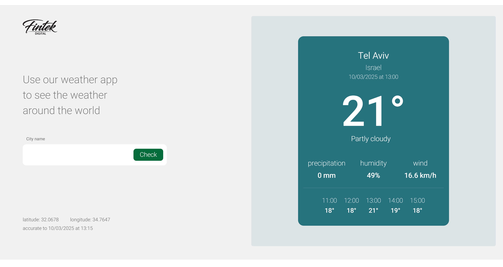

#  Weather App

This is a full-stack weather application built with **React (client-side)** and **Node.js (server-side)**.  
Users can enter a city name and receive real-time weather data fetched from the **WeatherAPI**.

##  Features
-  Search for a city and get current weather details.
-  Displays temperature, humidity, and weather conditions.
-  Fetches data from **WeatherAPI** via a custom Node.js backend.
-  Responsive and accessible design.

---

##  Project Structure
fintek
 ├── react
 │   ├── frontend   
 │   ├── package.json
 ├──  node          
 │   ├──  package.json
 ├── .gitignore
 ├── README.md


##  Installation
Run the following commands:

```bash
git clone https://github.com/yafi321/weather-app-project
cd fintek

cd react/frontend
npm install

cd ../../node
npm install

cd node
node app.js

cd ../react/frontend
npm run dev

```

##  Environment Variables (Required)
Before running the server, you must create a `.env` file inside the **node** directory with the following content:

env
API_KEY=your_weatherapi_key
PORT=5500

This project provides a full-stack weather application where users can search for a city and receive real-time weather data. Follow the setup instructions to run both the client and server successfully.

## Screenshot
